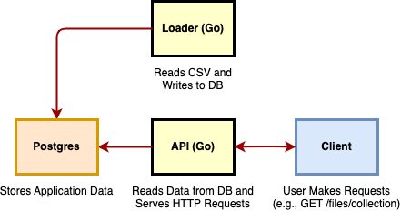
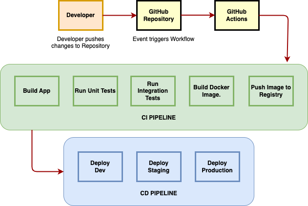
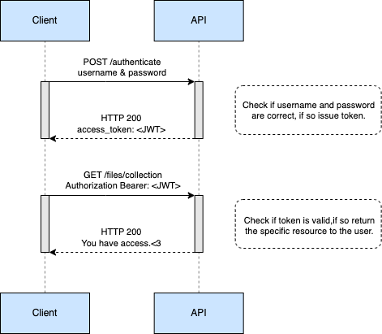

# planet

Planet is a Backend/Data application which offers 2 main functionalities:
 1. Trigger a data processing operation to transform a sample of raw data into usable data which is saved on a
 DB.
 2. An API server which serves user requests.

---

## Table of Contents

1. [Installation](#installation)
2. [Usage](#usage)
3. [Directory Structure](#directory-structure)
4. [System Diagram](#system-diagram)
5. [Services](#services)
6. [CI-CD Pipeline Diagram](#cicd-pipeline-diagram)
7. [API Authentication](#api-authentication)


---

## Installation

### Prerequisites

- Go 1.23.6 or later
- Docker

### Steps

1. Clone the repository:
   ```bash
   git clone https://github.com/radu2020/planet.git
   ```

2. Navigate to the project directory:

    ```bash
    cd planet
    ```

3. Make sure you have [Docker](https://www.docker.com/get-started) and [Docker Compose](https://docs.docker.com/compose/install/) installed on your machine. The easiest and recommended way to get Docker Compose is to install Docker Desktop. Docker Desktop includes Docker Compose along with Docker Engine and Docker CLI which are Compose prerequisites.


## Usage

### Running the app
You can run the application using Docker Compose, which will build and run the Go app in a container.

1. Build and start application:

    ```bash
    docker-compose up --build
    ```

2. Access application:

   You can access the application at `http://localhost:8080`.

3. Stop application:

    ```bash
    docker-compose down
    ```

### Running the tests

To run all tests:

```bash
go clean -testcache
go test ./...
```

## Directory structure

```
myproject/
│── cmd/
│   │── api/                 # API server entry point
│   │   └── main.go
│   │── loader/              # Data loader entry point
│   │   └── main.go
│
│── config/                  # Configuration file loader (e.g., database, environment)
│   └── config.go
│
│── data/                    # Sample data file
│   └── sample.csv
|
│── docs/                    # Diagrams (CI-CD pipeline, Authentication, System)
|
│── internal/                # Application logic
│   │── data/                # Data loading logic
│   │   ├── loader.go
│   │   └── parser.go
|   |
│   │── service/             # API service logic
│   │   └── service.go
|   |
│   └── storage/             # Store interactions
│       ├── sql.go
│       └── store.go
│
│── .env.example             # Environment variables example
│── .gitignore
│── docker-compose.yml       # Docker Compose configuration
│── Dockerfile               # Docker image build instructions
│── go.mod
│── go.sum                   # Go module file
│── LICENSE
└── README.md                # Project documentation
```

## System Diagram



### Sequence of Events
1. Postgres Starts:

- The Postgres container initializes and starts the PostgreSQL service.
- The database is ready for connections.

2. Loader Starts:

- The Loader container depends on the Postgres container being ready.
- The Loader reads the CSV data and writes it to the Postgres database in batches.

3. API Starts:

- The API container waits for the Postgres and Loader containers to be ready.
- Once both are up and running, the API starts.
- The API connects to Postgres to serve HTTP requests from users.

## Services
Key Components of the System: Postgres, Loader, and API.

### 1. Postgres (Database)
- Acts as the database service where all application data is stored.
Stores CSV data loaded by the Loader service.
- Used by the API service to serve requests from the database.

### 2. Loader (Go Application)
- Reads a CSV file from the ./data directory (mounted into the container).
- Parses the CSV data and inserts it into the Postgres database.
- The loader ensures the database is populated with data that the API can use.
- This service runs once to load the data into the database and can be re-run as needed.

### 3. API (Go Application)
- Connects to a Postgres database.
- Provides endpoints to interact with the data in the Postgres database:

`GET /files/collection`: Returns a file with .geojson extension used in the frontend to render into a heatmap using Mapbox. Example:

```json
{ 
    "type": "FeatureCollection",
    "features": [
        { "type": "Feature",
            "geometry": {"type": "Point", "coordinates": [102.0, 0.5]},
            "properties": null
        }
    ]
}

```

`GET /organizations/ids`: Fetches all organization IDs that have usage data in the database and returns a Json response. Example:

```json
{"org_ids":[87,74,29]}
```

> The API is using the [`github.com/paulmach/orb/geojson`](https://github.com/paulmach/orb) library to parse and convert geometry data into the GeoJSON format.

## CICD Pipeline Diagram
Here is a mini-design of how the CI/CD pipeline should work. This pipeline should be triggered whenever a new commit is pushed to a branch.



## API Authentication
### Context
Provide a brief outline for how to add authentication for the API assuming that:
- users will have accounts
- some of the routes in this project will only be available to authenticated users.

### Implementation

I would be implementing a Bearer Authentication Scheme (token authentication) as part of the API as follows:

1. Add additional endpoint which authenticates the user with username and password and returns a JWT access token to the client.
2. Add middleware to the protected routes. This middleware validates the Bearer token and gives access to authorized users.

Here is a diagram of how this would look like:




### Authentication

Request
```sh
curl -X POST http://localhost:8080/authenticate \
-H "Content-Type: application/json" \
-d '{"username": "testuser", "password": "password123"}'
```
Response
```json
{
  "token": "jwt-token"
}
```

### Accessing the protected routes

Request
```sh
curl -X GET http://localhost:8080/files/collection \
-H "Authorization: Bearer jwt-token"
```

Response
```json
{
  "message": "You have access to this data."
}
```

